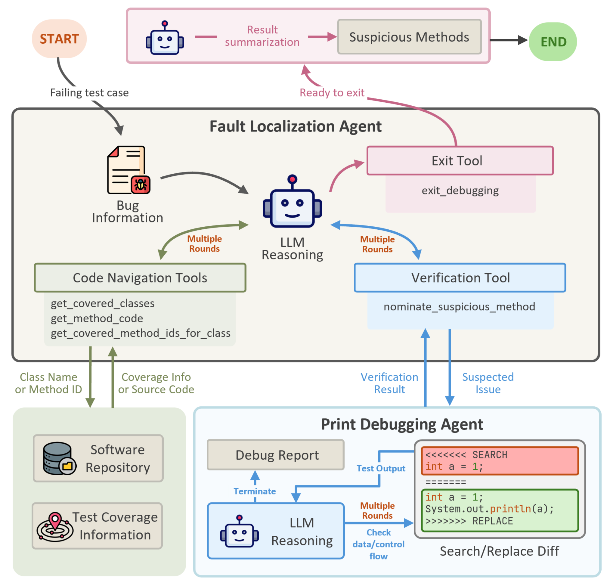
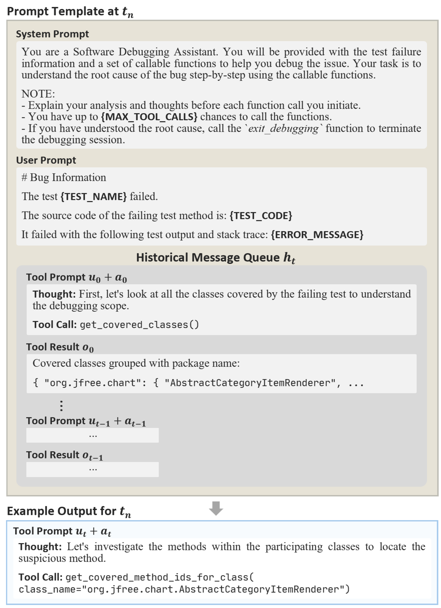
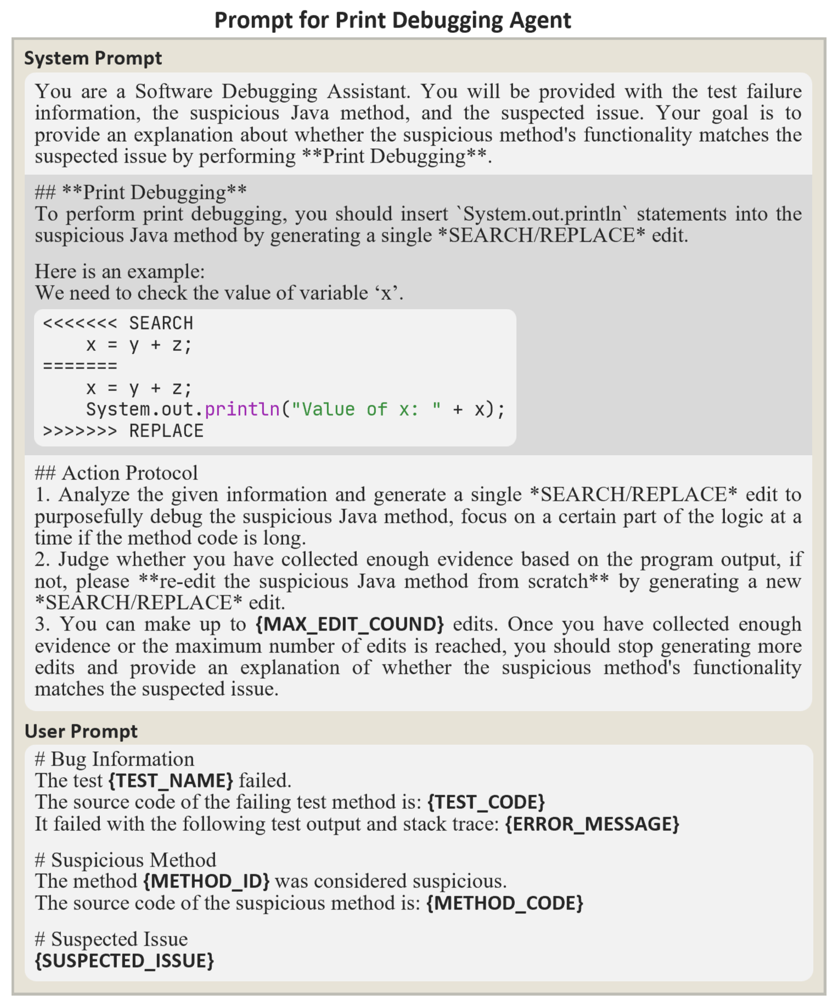

# PingFL

This is the official repository of paper **"Let the Code Speak: Incorporating Program Dynamic State for Better Method-Level Fault Localization"**.
PingFL is an LLM agent system that incorporates program dynamic information for more accurate fault localization.
Inspired by the print debugging technique of human developers, PingFL consists of two collaborative LLM agents: A fault localization (FL) agent equipped with several tools to pinpoint the root cause, and a print debugging (PD) agent that aims to verify the suspicious location nominated by the FL agent.
The evaluation results on the Defects4J benchmark show that PingFL outperforms other LLM-based approaches and surpasses traditional FL techniques in the cross-project scenario.
Besides, we discovered that the LLM can exhibit specific strategies and tool usage patterns for solving the fault localization task.
PingFL is cost-effective, it takes only an average of 0.22 dollars and 104.62 seconds for localizing a fault.

## Prompt Templates for FL Agent and PD Agent
The prompt templates are shown below:




The complete prompts can be found at `src/core/prompt.py`.

## Run PingFL from Scratch

### Step 1: Benchmark Installation

We evaluate PingFL on the Defects4J benchmark (tag v2.0.1), which can be found at:

Defects4J: [https://github.com/rjust/defects4j](https://github.com/rjust/defects4j)


### Step 2: Environment Installation

The required Python environment can be installed through the commands:

```shell
conda create -n PingFL python=3.11.11
conda activate PingFL
pip install -r requirements.txt
```

Then, adopt the files under `Defects4jMod/defects4j-2.0.1-jvm-mod` to the defects4j repository you have installed.

Finally, modify the config files in `Config` directory. You should focus on these properties:

- `java_agent_lib`: set as the path of the Java agent `MethodCallGraphBuilder/target/MethodCallGraphBuilder-1.0.jar`
- `bug_exec`: set to your own Defects4J execution file path
- `api_key`: set to your own api key for corresponding model

### Step 3: Preprocess

The preprocessing stage is a prerequisite for running PingFL. It is responsible for bug reproduction, bug information collection, code repository analysis, etc.
Run preprocess through the command:
```shell
python preprocess.py
```

### Step 3: Run PingFL

You can now run PingFL to localize all bugs with:
```shell
python run_all.py
```

For localizing a single bug, an example command is:
```shell
python run.py --config config/pingfl_gpt4o_gpt4turbo.yml --project Chart --bugID 1
```

The list of all bugs is in `dataset/all_bugs.csv`.

## Evaluate PingFL

After running PingFL, the debugging results will be generated under the `DebugResult` directory.

To evaluate the performance of PingFL, simply run:
```shell
python evaluate.py
```